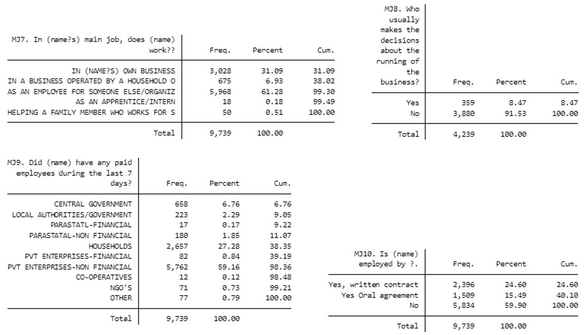
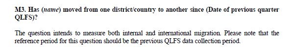
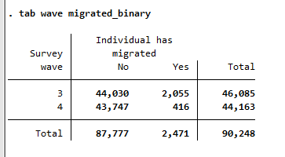

# Introduction to Zimbabwe (ZWE) Quarterly Labour Force and Child Labour Survey

- [What is the ZWE QLFS survey?](#what-is-the-zwe-qlfs-survey)
- [What does the ZWE QLFS survey cover?](#what-does-the-zwe-qlfs-survey-cover)
- [Where can the data be found?](#where-can-the-data-be-found)
- [What is the sampling procedure?](#what-is-the-sampling-procedure)
- [What is the significance level?](#what-is-the-geographic-significance-level)

## What is the ZWE QLFS survey?

The Zimbabwe National Statistics Agency (ZIMSTAT) started conducting Quarterly Labour Force Surveys (QLFS) in the 3rd quarter of 2021 to ensure timely reporting of labour statistics.

## What does the ZWE QLFS survey cover?

The Q3 2021 QLFS is the first of its kind. It follows the 2013 labour force framework adopted at the 19th International Conference of Labour Statisticians (ICLS) that provided new guidelines for measuring and compiling statistics on work, employment, and labour underutilization. The survey is nationally representative and has the following sample size:

| Year   | # of Households        | # of Individuals|
| :------- | :--------                             | :--------             |
| 2021 (Q3)       | N/A    | 46,085 |
| 2021 (Q4)       | N/A    | 44,163 |
| 2022 (Q1)       | N/A    | 44,442 |
| 2022 (Q2)       | N/A    | 43,362|
| 2022 (Q3)       | N/A    | 42,074 |
| 2022 (Q4)       | N/A    | 42,851 |

## Where can the data be found?
The microdata from the Quarterly LFS is available through the Zimbabwe Statistics [Website](https://www.zimstat.co.zw/labour-force-publications/). A quarterly report is available.

## What is the sampling procedure?
The sampling frame used for the LFCLS was the Zimbabwe Master Sample developed by the then Central Statistical Office after the 2002 Population Census. Except for Harare and Bulawayo, each of the other eight provinces was stratified into four strata according to land use: Communal Lands, Large Scale Commercial Farming Areas (LSCFA), Urban and Semi-Urban Areas, and Small-Scale Commercial Farming Areas (SSCFA) and Resettlement Areas. Only one urban stratum was formed each in Harare and Bulawayo, giving 34 strata in total. The sampling procedure is a two-stage sample design. The first stage was the selection of enumeration areas using the probability proportional to size criteria. The second stage was the selection of households in the selected enumeration areas using a random systematic sampling technique. 500 enumeration areas in total and 12,500 households were selected for the survey.

## What is the geographic significance level?

The survey is significant at the province level for each quarter and information is reported by male and female per province. It is not established in the report whether the disaggregation by province **and** sex is representative but it probably is. Disaggregation by province **and** area (urban or rural) is not shown in the reports. the GLD team assume this is because, while gender can be assumed to be evenly distributed in the province, urban and rural areas are not, requiring a larger sample size to ensure representativeness for the smaller category (i.e., urban areas in predominantly rural provinces, rural areas in urban provinces).

There are no reports on the annually appended data but it should be possible to disaggregate this data by province **and** area. However, not that the survey started in Q3 of 2021 so the 2021 dataset has a sample size about half as large as 2022.

## Other Noteworthy Aspects

### Misalignment of the questionnaire and raw data responses

In quarters 3 and 4 of 2021, response labels for questions 7, 8, 9 and 10 in the main job section in the raw data downloaded from the NSO website differ from questionnaire labels. The images below show the differences between the questionnaire (first image) and the raw data labels (second image).

  

  

  

  

### Employment Status - Jumps in `empstat`

In quarters 3 and 4 of 2021, the results for `empstat` values differs markedly between quarters, especially for the category of "contributing family workers". The images below show the this is also what the statistics office has reported and thus in the raw data.

  

  

  

  

The variable is stable for the year 2022. Estimates generated for 2021 should take this into account.

### No Household IDs

Household IDs (variable `hhid`) cannot be created for any quarter because the raw data does not contain household identifiers. Thus no secondary sampling units can be identified.

### Management of Quarterly Data
The quarterly data, as described above, were grouped by year to facilitate the analysis of the user. However, the user should note that though the aggregated data is representative at the province level, the sample size is bigger after appending. Also, the user should note that the lack of household ID prevented us from merging by ID, as such, all the observations in the appended file are independent and not identifiable beyond the random ID assigned at the harmonization stage.

### Change in ICLS definition

See the following [page](../LFS/ICLS_change.md) for details about ICLS definition changes that affect industry categories. The change applies from 2019 onwards.

### Highest level of education

Please see this [page](../LFS/Education.md) for a complete explanation on the education levels in ZWE.

### Migration reference period

The time interval between the 2011, 2014 and the 2019 LFS surveys was 5 years. The migration information covered always asked about any migration since the last survey. The reference period for migration information was thus always 5 years.

In the QLFS the reference period is to be the time since the last QLFS (see screenshot from the interviewer manual below).

  

  

However, in the first iteration of the QLFS (Q3 of 2021) the reference period is since the last LFS (in June 2019). That means that there are three reference periods to be taken into account, that the information on migration covers migration occurring within 5 years (2019 and before), within 2 years (Q3 of 2021), and within the previous 3 months (since Q4 of 2021).

As an example, the image below shows the raw number of people who said to have migrated in Q3 and Q4 of 2021. There are five times as many in Q3 than in Q4. This is not the result of migration variability but rather of changing reference periods. Variable `migrated_ref_time` informs the user of the time period migration variables are referring to in years.

  

  
