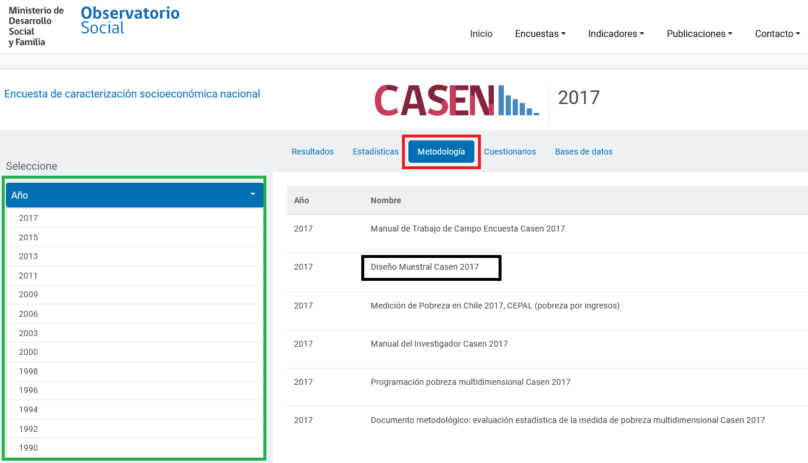

Introduction to the CHILEAN HOUSEHOLD SURVEY (Labour section) (CASEN)
================

- [What is the CHL CASEN?](#what-is-the-chl-casen)
- [What does the CHL CASEN cover?](#what-does-the-chl-casen-cover)
- [Where can the data be found?](#where-can-the-data-be-found)
- [What is the sampling procedure?](#what-is-the-sampling-procedure)
- [What is the geographic significance level?](#what-is-the-geographic-significance-level)
- [Other noteworthy aspects](#other-noteworthy-aspects)

## What is the CHL CASEN?

The Encuesta de **Ca**racterización **S**ocio**e**conomica **N**acional (CASEN - National Socioeconomic Characterisation Survey) is a Chilean household survey that contains sections for employment, education, dwellinga and income. The CASEN has been rolling since 1987. The GLD harmonization starts with 1990 a this is the first year wth public data (see section on where the data can be found below).  

## What does the CHL CASEN cover?

The CHL CASEN includes one labour section that collects information on employment situations of individuals surveyed. It further provides insights in the reasons for taking or not taking a job and the salary situation of the participant. In addition, other sections of CASEN cover demographic details (age, sex, location), education (academic), social security, labour market activities over the past week, as well as working hours and type of economic activities engaged. The years and sample size of CASEN harmonized for GLD are:

| Year	    | # of Households	| # of Individuals	|
| :-------	| :--------		    | :--------	 	      |
| 1990	    | 25,793	        | 105,189	          |
| 1992	    | 35,948	        | 143,459	          |
| 1994	    | 45,379	        | 178,057	          |
| 1996	    | 33,636	        | 134,262	          |
| 1998	    | 48,107	        | 188,360	          |
| 2000	    | 65,036	        | 252,748	          |
| 2003	    | 68,153	        | 257,077	          |
| 2006	    | 73,720          | 268,873           |
| 2009	    | 71,460          | 246,924 	        |
| 2011	    | 86,854          | 294,791           |
| 2013	    | 66,725          | 218,491           |
| 2015	    | 83,887          | 266,968           |
| 2017	    | 70,948          | 216,439	          |

## Where can the data be found?

The microdata is free and publicly available on the Ministry of Social Development website. The ministry created a [dedicated website](http://observatorio.ministeriodesarrollosocial.gob.cl/encuesta-casen) that records the results from CASEN, besides it contains complete information to understand the framework of the CASEN. For further information kindly get in touch with the World Bank Jobs Group. 

## What is the sampling procedure?

The CASEN uses a stratified two-stage design. In the first stage the primary sampling units (blocks in urban areas and "sections" in rural areas) are stratified and then selected with probability proportional to size. The second stage selects households in the primary sampling units with equal probability. the methodology may change slightly from year to year and users are advised to read the individual documents [here on the website](observatorio.ministeriodesarrollosocial.gob.cl/encuesta-casen-2017).

The website looks (as of April 2022) like the screenshot shown below. To find the documentation click on the methodology tab (red box) ensuring to be in the right year (green box). The document for 2017 is shown in the black box.

  

  

## What is the geographic significance level?

The results are significant at national, rural, urban, regional, and *cities of interest* levels as well as selected communities. The cities of interest and sizes of cities, however, may vary over time. It is thus important to check the individual methodology reports, as describe in the previous section

## Other Noteworthy Aspects 

### 2011 survey
The methodology and variable information for the year 2011 is limited compared to other years. In 2011 the Instituto Nacional de Estadística (INE - National Statistics Institute) jointly with the Ministry of Social Development changed the design of the survey. Yet, the output does not provide a clear number of households and individuals surveyed as such the numbers we report are those in the raw dataset but they could be different to the offcial numbers for that year.

### Geographic breakdown
The Chilean CASEN uses geographic stratification for the sampling of the survey. In the surveys the first (largest) subdivision level is the region, oftentimes labelled with numbers and/or names (e.g., Region II or Region X). The second level is the province and the third level are the communities. 

All years have information for the three levels, yet the information for communities is limited and variable across survey year (please refer to the methodology handbook for further details), For instance, the years 2011 and 2013, there communities was the second level of details for the surveys and no province information available in the raw files. Furthermore, the user should be careful in assuming that there have been geographic changes between survey years if there a province is absent in the labelling, this is because information may be absent but the province in real life exists in the country. For this reason, the GLD team chose to provide information for the user up to the second level, guaranteeing consistency at the regional (1st) level.

### Peculiarities of ISCO

Click [here](https://github.com/worldbank/gld/blob/c9bc90f4eec5222eaa2d9793187aa12a67778480/Support/Country%20Survey%20Details/CHL/CASEN/isco%20information.md) for a dedicated page on things to keep in mind while using occupation information from CASEN. 

### Peculiarities of ISIC

Click [here](https://github.com/worldbank/gld/blob/f0d1b72acb925746c93c4ae5d62b045ac72abdbf/Support/Country%20Survey%20Details/CHL/CASEN/isic%20information.md) for a dedicated page on things to keep in mind while using industry information from CASEN. 

### Who manages CASEN
It is important to note that though the INE is the manager of the survey design and implementation, CASEN is under the responsibility of the Ministry of Social Development and decisions on methodology and changes are handled by the ministry. 

Further information or questions about the microdata in this webpage can be directed to [World Bank GLD Focal Point](mailto:gld@worldbank.org).
