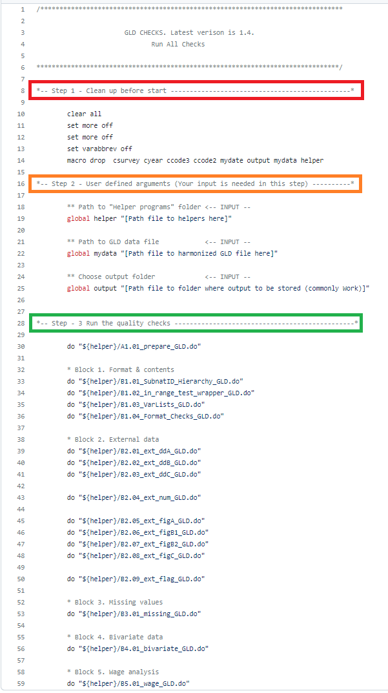

# Guide to the GLD quality checks

This is a guide to the quality checks for the Global Labor Database (GLD). After reading it, users should be able to:

- understand what the quality checks evaluate and how they work
- run the checks by themselves on a newly harmonized file, and
- read and interpret the output

The guide is divided itself in three major sections, one for each learning objective.

## Understanding the quality checks

The GLD quality checks intend to make sure that the GLD harmonized output is of sufficient quality to include the evaluated harmonized survey into the database. This is done in five blocks:

- Block 1 checks adherence of the survey data to the GLD formatting requirements (e.g., binary 0/1 variables have no responses outside 0 and 1).
- Block 2 compares key indicators from the harmonization to the same indicators from external sources (e.g., ILO, UN), to ensure external consistency.
- Block 3 assesses whether major variables are missing.
- Block 4 evaluates whether key relationships between pairs of variables align with ex-ante expectations (e.g., individuals occupied as professionals - `occup == 2` - chiefly have post-secondary education).
- Block 5 analyses central aspects of wages to ensure wage/earnings information agrees with stylized facts on wage behaviour (e.g., lower skilled workers' wages are, on average, lower than those of high skilled workers).

The next subsections discuss each block in more detail. We start, however, with the overall quality checks template.

### Overall quality checks template

The overall quality checks template is the only do-file the user needs to interact with regularly. It defines al relevant arguments and calls the do-files that run blocks 1 through 5. The code is [accessible here](Template_Q_Checks.do) and shown below:

  

  

The quality checks template proceeds in three steps. Step 1 readies Stata by cleaning up any data that may still be stored in the memory. Step 2 defines the arguments. It is the only section requiring user input. Users need to define three `globals`.

- `helper`: Define the path to the folder that contains all the files that run the quality checks (here, folder [Helper_programs_1.4](Helper_programs_1.4)). It is recommended to have this be a central place so it applies to all surveys and can easily be updated if the quality checks are amended.
- `mydata`: Define the path to the harmonized data the user wishes to check.
- `output`: Define the path to the folder the user wants the output to be stored in. It is recommended to make this the `CCC_YYYY_SURV_V0#_M_V0#_A_GLD/Work/Output` folder for consistency so other users may always know where to find the checks output.

Step 3 simply calls the do files from the helper path running the checks. This step no longer requires user involvement. It does, however, run through all the files that make up the checks. What these cover is the subject of the next section.

### Block 1 - GLD format checks

This block is concerned with ensuring that the harmonized output conforms to the [GLD data dictionary](../A%20-%20Guides%20and%20Documentation/GLD_Dictionary_v01.xlsx). The [code for the format checks](Helper_programs_1.4/B1.04_Format_Checks_GLD.do) is divided into sections (overall checks, demography checks, education checks, ...) and should be commented enough for users to understand what each step is doing. If you feel more explations are warranted, please [raise and issue](https://github.com/worldbank/gld/issues/new/choose) detailing the part not understood and we will endeavour to expand on it.

Broadly, the checks first evaluate whether the survey is set up correctly: filenames follow the [naming convention](../A%20-%20Guides%20and%20Documentation/WB%20Microdata%20Lib%20Folder%20and%20File%20Naming%20Management.docx) and variables are from the data dictionary.

Once this is established, the checks go through variables and, if they are in teh data, investigates whether they are in line with formatting rules. Some examples are:

- Check if vintages of survey (`vermast`/`veralt`) agree with the filename vintages (e.g., if file is `CCC_YYYY_SURV_V01_M_V02_A_GLD` `veralt` needs to be `"02"`).
- Check there is a single household head per household.
- Check that categorical variables have answers exclusively within the realm of feasible answers.
- Check that ISCO/ISIC codes are in the universe of possible codes for the pertinent classification (e.g., in ISIC 3 codes starting with `45` may only have either `0` or `1` through `5` as third digit; anything else would be outside the possible universe and flagged).

The format checks creates a list of flagged issues. It is stored as a `.dta` file in the `Block1_Format` folder (file `CCC_YYYY_Other Household Survey_Q_Format_Checks.dta`), and as an Excel spreadsheet in the `01_summary` folder (file `B1_format_results.xlsx`). Below is a screenshot of the spreadsheet output:

  

  

As shown, the output has five columns:

- Column Block describes the data dictionary block the variable causing the flag belongs to (demography, education, ...).
- Column Var_Name denotes the name of the variable flagged.
- Column Test_Type describes the kind of test the variable has undergone.
- Column Result denotes the number or share of cases with the issue (if this can be written).
- Column Flag guides the reader whether the issue is at odds with the data dictionary (`Flag = 1`) or technically possible, yet odd (`Flag = 99`).

### Block 2 - GLD external checks

To be added.

### Block 3 - GLD missing checks

To be added.

### Block 4 - GLD bivariate checks

To be added.

### Block 5 - GLD wage checks

To be added.
