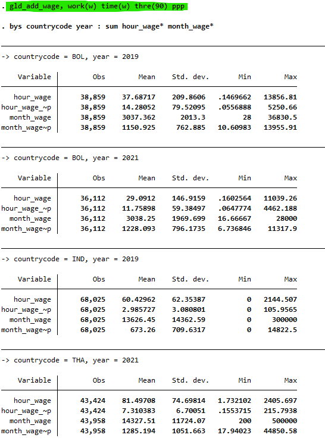
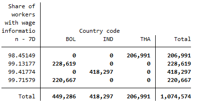
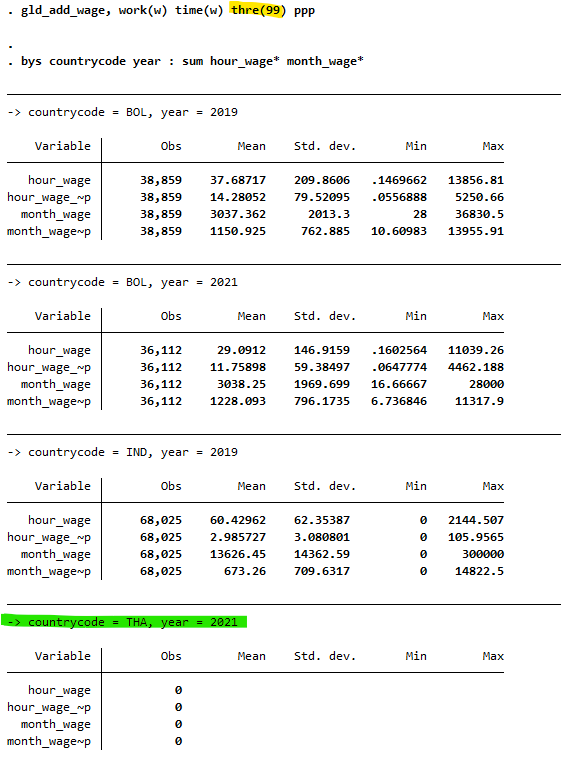
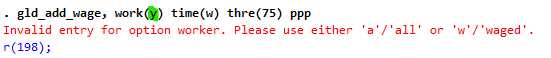
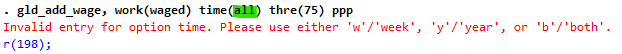
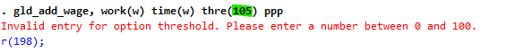
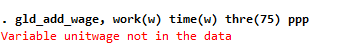
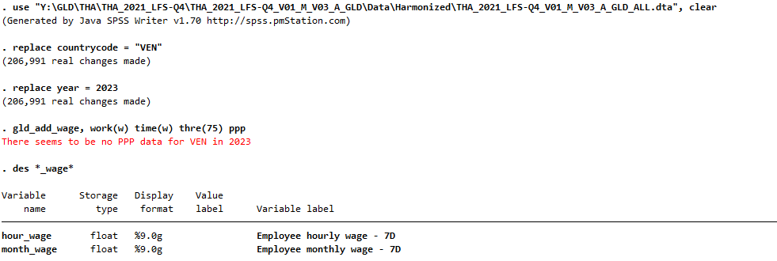
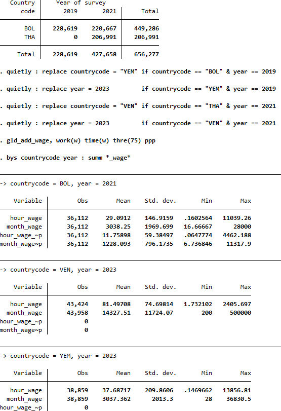
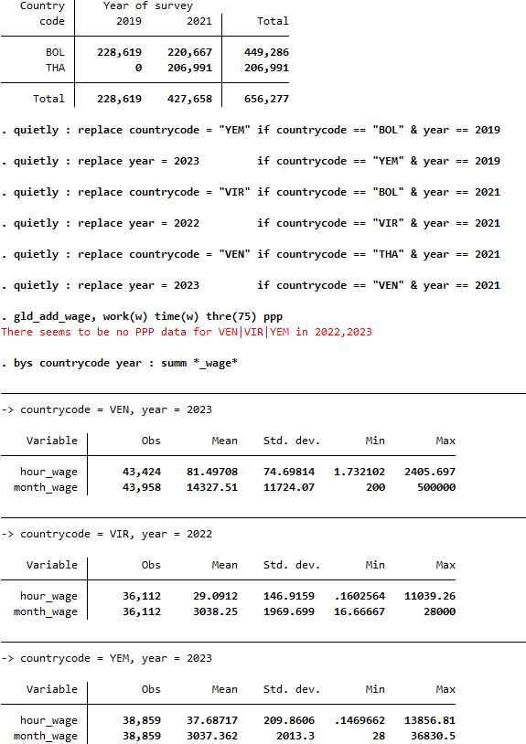

# GLD Wage Information Script README

## What is the issue?

GLD harmonizations do not currently calculate the hourly or monthly wage. This is done in the quality checks to evaluate data. However, it is GLD policy to invite users to calculate certain compound variables (like wage, made up of wage, unit, and hours worked information) on their own to ensure they are aware of limitations of the data. Nonetheless, to help in first estimates, users may leverage the `gld_add_wage` function created here to obtain a first estimate.

## How is it addressed?

The `gld_add_wage` function assumes GLD data are loaded. This can be data for a single country, a series from a country, or various years and countries. It will calculate the hourly and monthly wage based on the values of `wage_no_compen` (the gross earnings without employer contributions), `unitwage` (the unit the payment refers to), and `whours` (the hours worked in week) - or their 12 month recall period equivalents. For the precise details please [see the code](gld_add_wage.ado)

## How to install the function?

The function can be installed directly from the internet by typing the following into the console:

```
net install gld_add_wage, replace from("https://raw.githubusercontent.com/worldbank/gld/main/Support/Z%20-%20GLD%20Ecosystem%20Tools/GLD%20Add%20Wage%20Info")
```

Kindly make sure to keep the `replace` option after the comma. This is not necessary the first time but will allow Stata to overwrite the code if we update the function.

## How to run the code?

Once the desired GLD file(s) is(are) loaded, the user can call the function directly. The function uses [the wbopendata Stata function](https://github.com/jpazvd/wbopendata/tree/master) but it will automatically install it if the user does not have it. The syntax is the following:

```
gld_add_wage [, WORKer(string) TIME(string) THREshold(real 75) PPP]
```

The function command is followed by four options:

- WORKer(string): Defines the worker group to be used. Accepted values:
  - **"a"** or **"all"**: All workers
  - **"w"** or **"waged"**: Only wage workers

- TIME(string): Defines the recall period. Accepted values:
  - **"w"** or **"week"**: Weekly (7 days)
  - **"y"** or **"year"**: Yearly (12 months)
  - **"b"** or **"both"**: Both weekly and yearly

- THREshold(real): The percentage threshold (0-100) of cases required to have complete wage data before the script proceeds. Default is 75.

- PPP: If requested, will also add the PPP estimate of the wage values created.

Since `threshold` has a default value and PPP is an option, the minimum command necessary to work is:

```
gld_add_wage, work(w) time(w)
```

The above created the hourly and monthly wages for wage employees over the 7 day recall period - as long as 75% of wage employees have wage information (per the default threshold).

If the user wants to have the same but also (a) ensure that 90% of employees have information and (b) also add in the PPP values the command is:

```
gld_add_wage, work(w) time(w) thre(90) ppp
```

## Example run

The below example is based on the case where data from the following four surveys has been appended:

- THA_2021_LFS-Q4_V01_M_V03_A_GLD_ALL.dta
- BOL_2021_ECE_V01_M_V02_A_GLD_ALL.dta
- BOL_2019_ECE_V01_M_V01_A_GLD_ALL.dta
- IND_2019_PLFS_V02_M_V04_A_GLD_ALL.dta

Running the command 

```
gld_add_wage, work(w) time(w) thre(90) ppp
```

Will add variables `threshold`, `hour_wage`, `month_wage`, `pa_nus_ppp`, `hour_wage_ppp`, and `month_wage_ppp`. Below we can see the output of the wage variables by country and year:

<br></br>

<br></br>

There are values for all years and countries. However, if we look at the thresholds by countries (screenshot below), we observe that in the case of Thailand just under 98% of the wage workers have the relevant variables to calculate wages. 

<br></br>

<br></br>

Hence we can test that setting the threshold option to 99 should result in no numbers being calculated for Thailand. In effect, as shown below, all observations for Thailand are missing, while the values for the other countries remain the same.

<br></br>

<br></br>

## Error handling

The function has a set of error handling choices designed to inform the user about issues with the data. Below we highlight three: incorrect entry of arguments, unmet threshold, and unavailable PPP values.

### Incorrect entry of function arguments

The function automatically checks whether the arguments passed to the the function arguments (worker, time, and threshold) are correct and informs users of the errors, as shown in the images below.

<br></br>

<br></br>

<br></br>

<br></br>

<br></br>

<br></br>

### Missing key variables

The function will also inform users if relevant variables are missing. In the below example, the variable unitwage is not in the data. Without the function cannot proceed and execution stops.

<br></br>

<br></br>

## Unavailable PPP values

If PPP data is not available for any country, the function will inform the user.

In the case shown below, we convert the country to Venezuela and the year to 2023 (as we know that at the time of writing, the PPP value is missing). As shown, the function informs the user but still calculates the local currency values.

<br></br>

<br></br>

If at least one of the options is present, the function will continue, yet the values for the countries without PPP values will be missing. In the below example data from Bolivia and Thailand is changed to cases without PPP to show the functioning.

<br></br>

<br></br>

If there is not information for any of the countries, as in the constructed case shown below, the function will inform the user of the situation and not produce the PPP variables. 

<br></br>

<br></br>

Note that the information may not be inclusive of all cases. In the above case, we have YEM 2023, VIR 2022, and VEN 2023. Hence the information lists the countries and the years. This does not mean that there is no information for YEM in 2022 or VIR in 2023.
