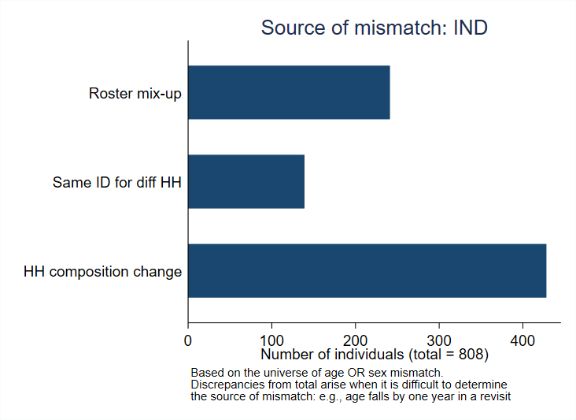
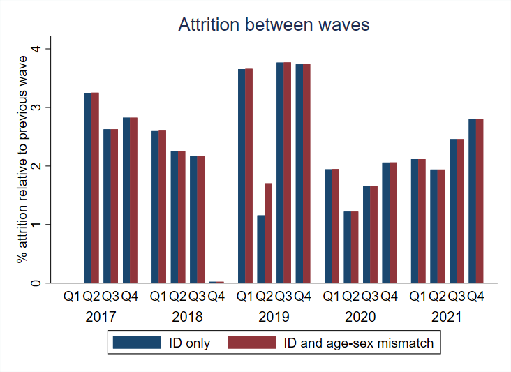

# Introduction to GLD Panel Diagnostic Tools

## GLD Panel Construction Workflow
The process of panel data analysis is a meticulous endeavor, and our package is tailored to streamline this workflow. The journey begins with **appending**, where users can seamlessly extract the most recent versions of surveys from the GLD folder. This step emphasizes ensuring a consistent data format across surveys and promptly flags any variables that reappear in multiple surveys. As the process progresses to the **construction of key variables**, emphasis is placed on generating essential variables such as `panel`, `visit_no`, `hhid_panel`, and `pid_panel`. This stage also warrants checks for internal consistency, for instance, verifying the relationship between variables like `wave` and `visit_no`. Additionally, it's essential to look out for any ID re-usage across non-consecutive survey years. The final phase revolves around **panel quality check**, where the data's integrity is held to the highest standard. It involves a thorough examination of discrepancies in time-invariant variables, assessing the plausible origins of these mismatches, and a comprehensive measurement of attrition.

## Package installation

To install the package, users need to type the following in the console:

```
net install gldpaneltools, replace from("https://raw.githubusercontent.com/worldbank/gld/panels/Support/Z%20-%20GLD%20Ecosystem%20Tools/GLD%20Panels")
```

## Appending
Within the appending category, there's the `gldpanel_append_check` program. This serves as a post-command for the `filelist`. Its primary function is to identify and notify users about inconsistencies in data types and any missing variables across surveys. Users simply need to type `gldpanel_append_check` after running the `filelist` command. See example below:

```
cd "C:\path_to_your_datasets_folder"
filelist
gldpanel_append_check
```

## Panel Construction
For those working on constructing panels, two programs are particularly of note:
- `gldpanel_wave_visit_check` checks the uniqueness of the visit number for every wave. It ensures that each visit for a given HH corresponds to only one wave. 
- `gldpanel_id_check` examines the use of individual and household IDs. Specifically, it identifies instances where an ID has been used in non-subsequent survey years or multiple times within a single survey year.

### Using the `gldpanel_wave_visit_check` command in Stata

The `gldpanel_wave_visit_check` command assists users of the Global Labor Database (GLD) in verifying that wave information is uniquely tied to a visit number for each household within a given year. Additionally, this command comes with an optional correction feature which, when invoked, will generate a corrected visit number variable.

#### How to Use

Execute the command as follows: 

```stata
gldpanel_wave_visit_check [, hhid(varname) wave(varname) year(varname) visit_no(varname) correction]
```
- If users do not define specific variable names, the command assumes the names as `hhid`, `year`, `wave`, and `visit_no`, which are all variables in the GLD template.

- There is also an option to "correct" the visit number so that each household-wave is unique within a household. The process involves getting the most frequent `visit_no`-`wave` combinations within a household, across individuals, and creating a variable called `visit_no_corrected`

### Using the `gldpanel_id_check` command in Stata

The `gldpanel_id_check` command helps identify instances where the same individual ID (PID) appears in non-subsequent years and cases where the same PID is reused within a year across different waves.

#### How to Use

Execute the command as follows:
```stata
gldpanel_id_check [, hhid(varname) pid(varname) wave(varname) year(varname)]
```
- If users do not define specific variable names, the command assumes the names as `hhid`,  `pid`, `year`, and `wave`, which are all variables in the GLD template.

- After running the command, watch for any error messages. These messages will guide you to potential data inconsistencies and advise on the next steps.


## Panel Quality Check
Ensuring the quality of panels is crucial, and the package offers several programs for this purpose:
- `gldpanel_issue_check` is a visual tool that produces bar charts detailing the size of mismatches by age and/or sex. This can help in quickly pinpointing demographic segments where data might have inconsistencies.
- `gldpanel_check_source` takes this a step further by generating bar charts that aim to identify potential causes of these mismatches.
- Lastly, `gldpanel_attrition` aids in the analysis of data attrition. It creates bar charts that present different attrition measures, providing insights into how much data might be lost or overlooked over time and across different survey iterations.

### Using the `gldpanel_issue_check` command in Stata
The `gldpanel_issue_check` command measures the size of inconsistencies in sex and/or age across years and waves for the same person ID. 

#### How to Use
Execute the command as follows:

```stata
gldpanel_issue_check [, hhid(varname) pid(varname) year(varname) age(varname) wave(varname) relationharm(varname) male(varname) countrycode(varname)]
```
- After running, the command produces a horizontal bar graph highlighting the issues found across different categories for the selected country. See example below:


### Using the `gldpanel_check_source` command in Stata
The `gldpanel_check_source` command aids in identifying potential inconsistencies such as mismatches in rosters and changes in household compositions across survey waves.

#### How to Use
Execute the command as follows:

```stata
gldpanel_check_source [, hhid(varname) pid(varname) age(varname) sex(varname) wave(varname) year(varname)]
```
- As in the case for the programs above, without specifying the variable names, the command assumes that the dataset uses variable names used in the GLD.
- After execution, the command will produce a horizontal bar graph indicating the source of discrepancies in the dataset, focusing on mismatches in age or sex. See example below:


### Using the `gldpanel_attrition` command in Stata
The `gldpanel_attrition` command assists users in assessing attrition rates in a panel dataset. It enables users to measure the attrition between waves for any subsequent wave or all subsequent waves from the first wave of apeparance. It also distinguishes attrition based on ID, and based on both ID and inconsistent age or sex for the same ID. In the latter case, it would treat as attrition those families that were replaced in the sample but retained the same household ID. 

#### How to Use
Execute the command as follows:

```stata
gldpanel_attrition [, hhid(varname) pid(varname) wave(varname) year(varname) visit_no(varname) sex(varname) age(varname) consecutive_waves any_wave all_waves]
```

- As in the case for the programs above, without specifying the variable names, the command assumes that the dataset uses variable names used in the GLD.
- It is required to indicate the method of calculating the attrition rate. The options are: `consecutive_waves` for attrition between consecutive waves; `any_wave` for attrition between the first wave of interview and any subsequent re-interview; and `all_waves` for attrition between the first wave of interview and all subsequent waves (e.g., if an individual is interviewed three times, but not in the last round, he/she will be considered an "attrition")
- After executing the command, a bar chart will be displayed showing the attrition rates for ID only, and ID and age-sex mismatches. The latter means if the same person ID is re-used for an individual with a completely different age (with allowance of one year) or sex, then that case is treated as an attrition.
- See example below, which uses the `consecutive_waves` option:




