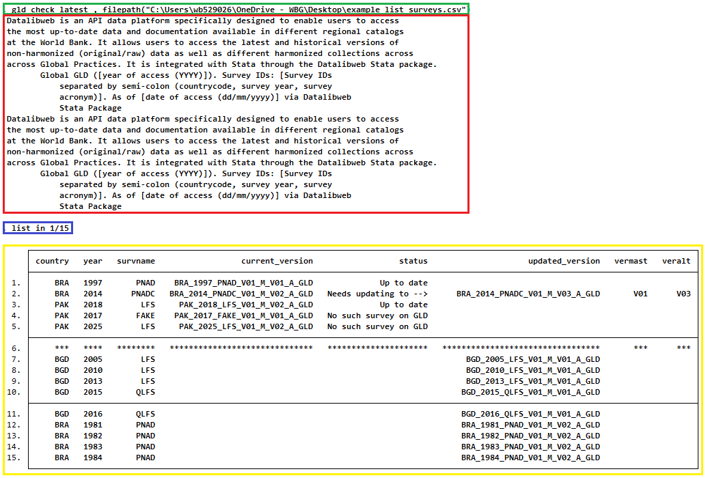
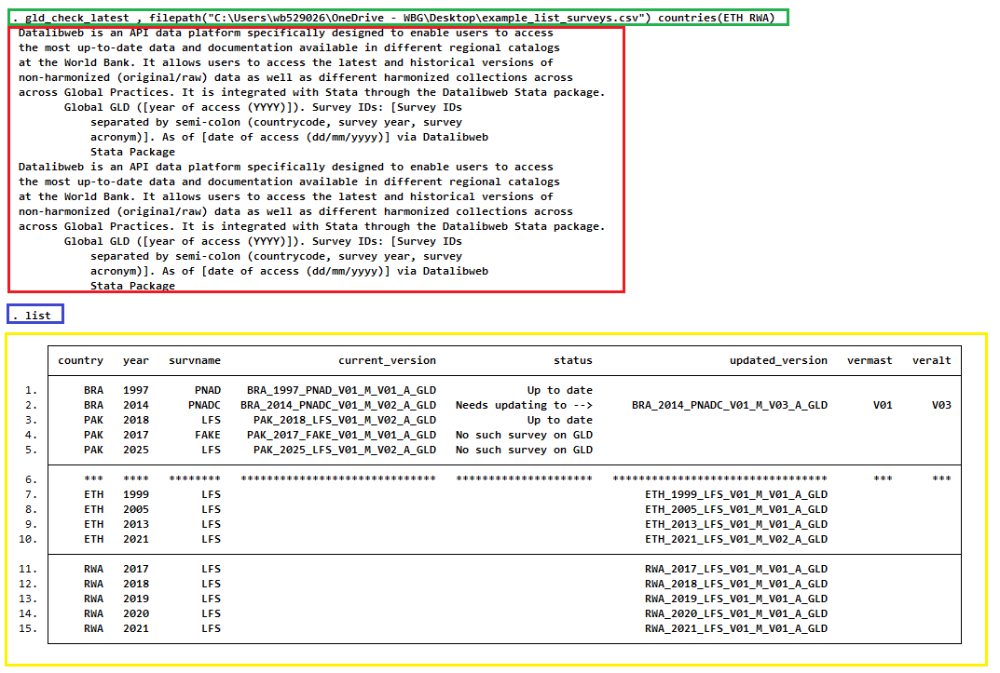
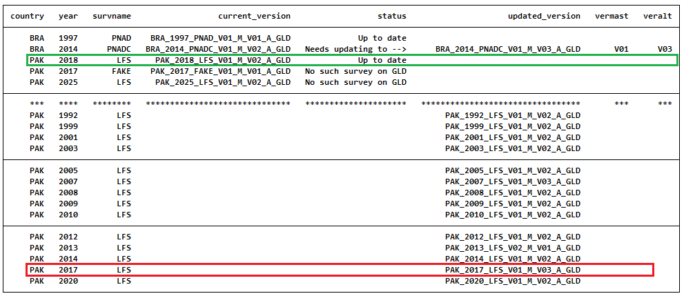

# GLD files update check function

## What is the issue?

The Global Labor Database (GLD) is a live database that is updated constantly. No only do we add new surveys, but we also update already published surveys if we spot or are notified of an error and correct it. If you spot something, please reach out by either [creating an issue](https://github.com/worldbank/gld/issues/new/choose) or writing to <gld@worldbank.org>.

The problem arises if you have obtained a couple of GLD surveys and have started to work on them. How do you know if your surveys are still the latest standard?

## How is it addressed?

On option to know whether the survey is the latest is to track this repository for updated. If you are a World Bank staff who uses the Stata datalibweb programme, you could use datalibweb to see the list of files and compare whether yours are the latest.

This is a somewhat tedious and repetitive task. Hence this code we propose (on Stata and for World Bank staff - R version for all users to come) will read a list of surveys and let you know whether the constituents are up to date or not.

## How to run the code?

### Installing the code

The first thing is to install the programme. This can be done directly from the internet by typing the following into the console:

```
net install GLD-latest-file-check, replace from("https://raw.githubusercontent.com/worldbank/gld/main/Support/Z%20-%20GLD%20Ecosystem%20Tools/GLD%20files%20update%20check")
```

Make sure to keep the `replace` option. This is not necessary the first time but will allow Stata to overwrite the code if we update this function (and now you would need alert for those updates, technically. It never ends... Sorry! Much less likely, though).

### Creating a CSV file listing the surveys you have 

With the programme installed, you need to create first a CSV file with the files you currently have and wish to check. The file should have a single column (the first) and have a header at the top (the header name does not matter as long as Stata can read it - variable names must start with a letter or an underscore) like the file shown in the screenshot below.

<br></br>

<br></br>

Store the file somewhere on your system and note the path to the file. This is the only argument necessary to be passed to the function. The example file is stored in `"C:\Users\wb529026\OneDrive - WBG\Desktop\example_list_surveys.csv"`.

### Running the function - Only with `filepath` argument

With the above file path, to evaluate the surveys all we need is to call the function and pass the path to the `filepath` argument, that is:

```
gld_check_latest, filepath("C:\Users\wb529026\OneDrive - WBG\Desktop\example_list_surveys.csv")
```

Adding the command `list in 1/15` so Stata shows the first 15 lines of output gives the following:

<br></br>

<br></br>

The function evaluates the surveys passed and after that lists all other surveys in GLD available to us. If we want to receive that information only for select countries we can use the `countries` argument.

### Running the function - Adding a list of countries of interest 

Passing the argument `countries` to the function allows us to reduce the info on surveys in GLD not listed in the CSV file to only countries of interest. The countries need to be listed using their capitalised [three letter codes](https://en.wikipedia.org/wiki/ISO_3166-1_alpha-3) separated by a space. They can be in quotes or not (i.e., `countries(ARG BRA)` will work the same as `countries("ARG BRA")`).

Using the same file path, but also interested in the surveys from Ethiopia and Rwanda the command would be:

```
gld_check_latest, filepath("C:\Users\wb529026\OneDrive - WBG\Desktop\example_list_surveys.csv") countries(ETH RWA)
```
and listing this output gives:

<br></br>

<br></br>

### Error messages of the function

Before passing on to the interpretation of the results, note that the function does some evaluations and will alert the user of potential errors (see [sections 1 and 2 of the code](gld_check_latest.ado)). In particular it checks for:

1. That the `filepath` argument has a `.csv` extension at the end;
2. That the `filepath` argument matches an existing file;
3. That the `countries` argument is made up of three capital letters.

Each test will inform the user of the error and request correcting it. Entering a three letter code that does not correpsonde to any country (e.g., `ETX`) will simply result in no GLD info shown beyond the surveys listed in the user-generated CSV file.


## How to interpret the results?

How shall we read the above? The first thing to note is that the structure is the same regardless of whether we passed the `countries` argument or not. The inputted function is at the start (green box). The code uses datalibweb in the background to check for the latest GLD surveys and this creates the datalibweb output shown (red box). The `list` command is in the purple box while the actual output is in the yellow box.

The original CSV file listed five surveys and this is shown in the first five rows. The first four columns serve to identify the survey by detailing the country, year, and survey name, as well as the current file version (i.e., the full name). 

The next column, `status` informs the user of the, well, status, of the survey version. If it is the latest it will simply say "Up to date", as it does in the 1st and 4th rows. If a newer survey version of the one listed has been released the status will be "Needs updating to -->" and the exact details of the version to update to are noted in columns `updated_version`, `vermast`, and `veralt`.

If the survey is not in GLD the status will simply note "No such survey in GLD" (e.g., if a GMD survey was listed).

This output is followed by a blank line (filled with `************`) to symbolise the break in the document: What follows are GLD surveys not listed. In these cases, only column `country`, `year`, `survname`, and `updated_version` are given.

Note that if we pass one of the countries in the list of surveys as argument, the list of GLD surveys will not contain the surveys already in the user-provided list. In the below example, where Pakistan was passed as the country argument (`countries(PAK)`), the 2018 LFS survey (green box) is among the ones from the CSV file (noted as "up to date"). The user list also has a made-up 2017 "FAKE" survey. We can see that the function has listed a 2017 GLD survey (red box) as this was not covered by the list.

<br></br>

<br></br>


