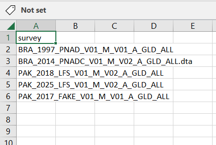
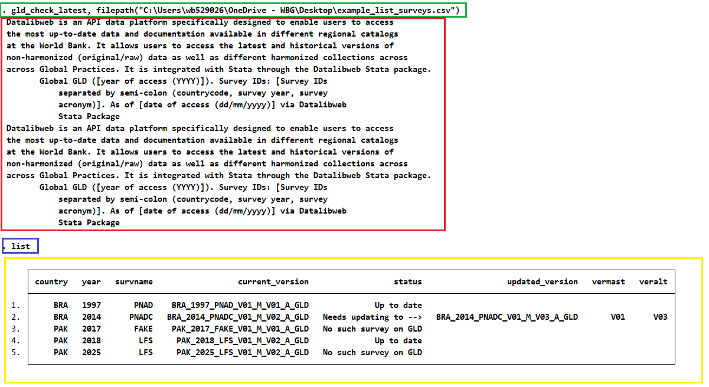

# GLD files update check function

## What is the issue?

The Global Labor Database (GLD) is a live database that is updated constantly. No only do we add new surveys, but we also update already published surveys if we spot or are notified of an error and correct it. If you spot something, please reach out by either [creating an issue](https://github.com/worldbank/gld/issues/new/choose) or writing to <gld@worldbank.org>.

The problem arises if you have obtained a couple of GLD surveys and have started to work on them. How do you know if your surveys are still the latest standard?

## How is it addressed?

On option to know whether the survey is the latest is to track this repository for updated. If you are a World Bank staff who uses the Stata datalibweb programme, you could use datalibweb to see the list of files and compare whether yours are the latest.

This is a somewhat tedious and repetitive task. Hence this code we propose (on Stata and for World Bank staff - R version for all users to come) will read a list of surveys and let you know whether the constituents are up to date or not.

## How to run the code?

### Installing the code

The first thing is to install the programme. This can be done directly from the internet by typing the following into the console:

```
net install GLD-latest-file-check, replace from("https://raw.githubusercontent.com/worldbank/gld/main/Support/Z%20-%20GLD%20Ecosystem%20Tools/GLD%20files%20update%20check")
```

Make sure to keep the `replace` option. This is not necessary the first time but will allow Stata to overwrite the code if we update this function (and now you would need alert for those updates, technically. It never ends... Sorry! Much less likely, though).

### Creating a CSV file listing the surveys you have 

With the programme installed, you need to create first a CSV file with the files you currently have and wish to check. The file should have a single column (the first) and have a header at the top (the header name does not matter as long as Stata can read it - variable names must start with a letter or an underscore) like the file shown in the screenshot below.

<br></br>

<br></br>

Store the file somewhere on your system and note the path to the file. This is the only argument necessary to be passed to the function. The example file is stored in `"C:\Users\wb529026\OneDrive - WBG\Desktop\example_list_surveys.csv"`.

### Running the function - Only with filepath argument

, so in the example the code is:

```
gld_check_latest, filepath("C:\Users\wb529026\OneDrive - WBG\Desktop\example_list_surveys.csv")
```

Adding the command `list` so Stata shows the output gives the following:

<br></br>

<br></br>

### Running the function - Adding a list of countries of interest 


## How to interpret the results?

How shall we read the above? The first thing is to note the inputted function at the start (green box). The code uses datalibweb in the background to check for the latest GLD surveys and this creates the datalibweb output shown (red box). The `list` command is in the purple box while the actual output is in the yellow box.

The original CSV file listed five surveys and so the output has five as well. The first four columns serve to identify the survey by detailing the country, year, and survey name, as well as the current file version (i.e., the full name). 

The next column, `status` informs the user of the, well, status, of the survey version. If it is the latest it will simply say "Up to date", as it does in the 1st and 4th rows. If a newer survey version of the one listed has been released the status will be "Needs updating to -->" and the exact details of the version to update to are noted in columns `updated_version`, `vermast`, and `veralt`.

If the survey is not in GLD the status will simply note "No such survey in GLD" (e.g., if a GMD survey was listed).

