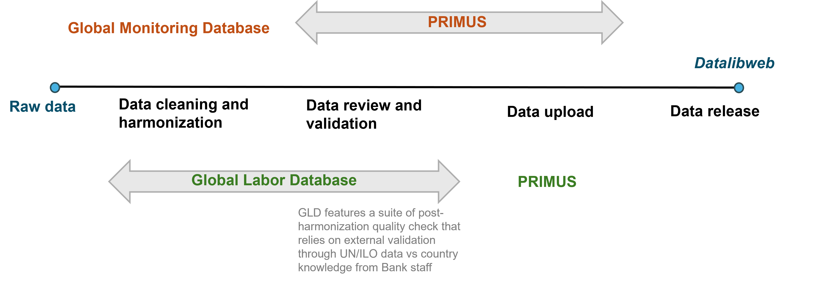

# Uploading GLD data into PRIMUS

## Motivation for Integrating the Global Labor Database (GLD) into PRIMUS

The **Global Labor Database (GLD)** is the World Bank’s flagship initiative for harmonizing labor force and household surveys with labor modules. GLD ensures transparency and reproducibility by documenting each step of the harmonization process—from raw data acquisition to the coding of harmonized variables—and by sharing codes and metadata openly through GitHub. It is both a research asset and a public good that empowers users to rely on harmonized “as-is” files or to customize the process to suit deeper analytical needs. 

Currently, [**Datalibweb**](https://github.com/worldbank/datalibweb) acts as the front-end interface through which World Bank users download harmonized labor data from GLD using the Stata API. [PRIMUS](https://github.com/worldbank/primus), on the other hand, is the institutional platform designed to ensure that data uploaded to Datalibweb meets Bank-wide clearance protocols, with roles for uploaders, approvers, and finalizers. It provides the infrastructure for version control, metadata validation, and auditability of microdata workflows. PRIMUS also includes built-in Stata commands and functions that enable the entire upload process to be scripted. 

All datasets in the GLD server have already undergone extensive quality checks. These include validation against external indicators (e.g., ILO, WDI), over-time consistency tests, and consultation with national statistical offices and World Bank regional staff. As such, the integration of GLD into PRIMUS is not to conduct additional validation but to use PRIMUS as a structured conduit to upload datasets to Datalibweb in accordance with institutional protocols as the below figure shows graphically.
 
  
  

    

  
  

Integrating GLD into PRIMUS requires careful attention to a number of technical and procedural requirements unique to the PRIMUS platform. For instance, PRIMUS mandates that each upload of a harmonized file be accompanied by an XML file containing summary indicators derived from the microdata. The upload process also differs depending on whether the dataset represents a new entry in GLD or an update to an existing dataset, with each scenario requiring distinct steps. In addition, there are important platform-specific constraints to consider: survey folders must not exceed 1.5 GB in total size, only certain file types are accepted, and strict version sequencing is enforced (e.g., version 2 cannot be uploaded unless version 1 already exists).

The goal of this project is two-fold. First, it seeks to ensure that all these complications and requirements can be addressed through a streamlined workflow, eliminating the need for manual uploads. Second, it aims to automate the upload process itself, through integration with Stata, so that PRIMUS uploads can occur seamlessly in the background without requiring significant analyst effort.

This GitHub page serves as a public resource for documenting the integration of the Global Labor Database (GLD) into PRIMUS. It provides:

- The full codebase required for automating uploads,
- Detailed explanations of the logic behind each step,
- Documentation of PRIMUS protocols and constraints,
- Reflections on best practices for addressing PRIMUS-specific requirements.

## The PRIMUS workflow

**1. Reconciliation and Case Classification**
The workflow begins by comparing the contents of the GLD server with Datalibweb records to identify which survey versions need to be uploaded. This step categorizes each case into one of several types: new upload, version update, or gap-filling due to missing intermediate versions. The result is an Excel file detailing the required upload actions per survey.

**2. Preparation and Packaging**
For each identified survey, the harmonized and (when applicable) raw data folders are prepared. XML metadata is generated for each harmonized file, and survey folders are compressed into ZIP files following PRIMUS folder structure and file type constraints. Folder size is checked to ensure it does not exceed 1.5 GB. If it does exceed the size, a text document placeholder is created and uploaded. The document explains how users can request the full dataset.

**3. Upload to PRIMUS**
Using the Stata PRIMUS API, raw and harmonized ZIP files (along with the XML) are uploaded into the system. Each upload creates a transaction ID that is recorded in a log file. Raw files are only uploaded for relevant cases (e.g., new uploads or raw updates). Surveys with missing .dta files or invalid configurations are skipped and flagged.

**4. Confirmation of Transactions**
Once uploaded, all transactions are initially in draft status. The script then confirms each transaction, moving it from draft to pending approval. This step is handled separately from upload to avoid timing issues that arise when trying to confirm and approve too soon after upload.

**5. Approval of Uploads**
On a separate run (usually the following day), the confirmed transactions are reviewed and approved using another script. This final step makes the datasets visible and accessible on Datalibweb. Only transactions that passed earlier checks and are confirmed without errors are submitted for approval.

## Navigating this repository

### [Tasks folder](./Tasks/)

The `Tasks` folder contains the `.do` files that execute the main stages of the upload pipeline. Each task corresponds to a discrete set of operations, executed in sequence as part of the end-to-end workflow:

- **Task 1 – Upload and Confirm:** Identifies which GLD surveys need to be uploaded or updated in Datalibweb. It prepares the files, creates the required XML metadata, compresses folders into ZIPs, and uploads the harmonized and raw files to PRIMUS. It also confirms the transactions to move them out of draft status.
- **Task 2 – Approve:** Automatically reviews the uploaded and confirmed transactions in PRIMUS and submits them for final approval, making the datasets visible and accessible in Datalibweb.
- **Task 3 – Reconciliation Report:** Generates diagnostic reports comparing GLD and Datalibweb holdings, flags inconsistencies, and informs the Task 1 logic about which surveys require uploads, version updates, or no action.

### [Helpers folder](./Helpers/)

The `Do files` folder contains reusable subroutines and helper scripts used by the main tasks. These include:

- Functions for constructing dynamic folder paths
- XML generation code for PRIMUS compliance
- Logging utilities for tracking file size, errors, and transaction IDs
- Zip and upload handlers that interface with `robocopy`, `tar`, and the `primus` API

These modular scripts ensure flexibility, traceability, and maintainability of the PRIMUS automation process.

### [Batch Code folder](./Batch-Code)

This folder contains Windows batch files (`.bat`) designed to automate the execution of Stata scripts without requiring manual intervention. Batch processing is especially useful for routine operations such as scheduled uploads to PRIMUS, daily reconciliation checks, or large-batch metadata generation.

Each `.bat` file includes a command-line call to `StataMP` or `StataSE`, pointing to a specific `.do` file located in the `Tasks` or `Helpers` folders. 

When run, this command opens Stata in batch mode (i.e., without the GUI), executes the specified script, and closes automatically after execution. This setup enables the upload pipeline to run entirely in the background—no user input required.

To further streamline operations, these batch files are linked to the **Windows Task Scheduler**, which allows us to automate the workflow by specifying exactly when the code should run. For instance, we can schedule Task 1 (Upload and Confirm) to execute every Monday at 2:00 AM, and Task 2 (Approve) to run the following day. This ensures minimal manual intervention, regular and timely uploads, and better alignment with PRIMUS system availability and clearance cycles

### [Documentation folder](./Documentation)

#### [PRIMUS Rules and Constraints](./Documentation/PRIMUS-Rules-Constraints.md)

This document outlines the institutional rules enforced by PRIMUS. It categorizes constraints into areas such as upload cycle requirements, transaction ID handling, version sequencing, and folder size or structure rules. Understanding these rules is essential for ensuring that uploads are successful and compliant with Bank protocols.

#### [Best Practices](./Documentation/Best-Practices.md)

This document captures the lessons learned and best practices developed while integrating GLD into PRIMUS. It offers strategies to overcome size restrictions, streamline version control, and maintain data traceability. These recommendations are meant to improve efficiency, minimize human error, and ensure smooth operations in future integrations.

