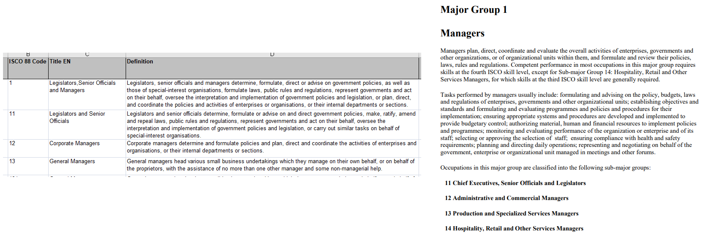
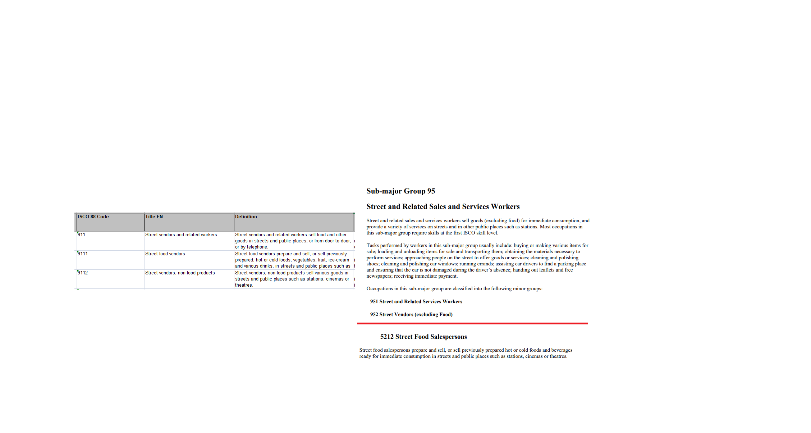
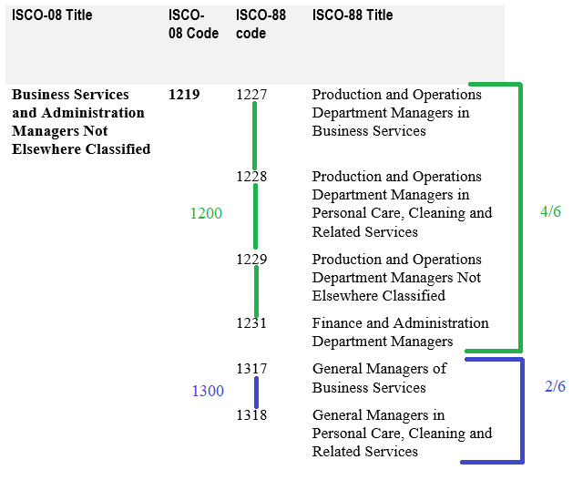
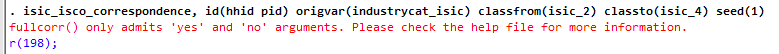

# Conversion tool between ISCO and ISIC versions

Surveys harmonized in GLD (and in general) are coded to the standards of the time. This is an issue with [definitions of employment](https://ilostat.ilo.org/resources/concepts-and-definitions/description-work-statistics-icls19/), for example, which may change over time.

Similarly, information on occupations and industries are coded in surveys using the classification version the survey organizers (usually the NSO - National Statistics Office) are applying at the time. This may be an international or a national classification. The GLD team will use the international classification wholesale or map the national classification to the closest international version. For example, Zimbabwe's LFS are coded using the International Standard Industrial Classification (ISIC) Revision 4. Harmonizers only ensure the format is in line with GLD standards and otherwise import the raw information. In Bolivia, on the other hand, information on occupation is coded using the national *Clasificación de Ocupaciones de Bolivia - 2009* (COB-2009) which is, in turn, based on the 2008 version of the International Standard Classification of Occupations (ISCO-08). In such a case, the GLD team converts the information ot ISCO-08.

In the future, these versions will change as new revisions of the classification arise. Across countries the versions also change. For example, occupation information in Indian LFS is done based on the 1988 ISCO version (ISCO-88). Since the versions differ we need an additional step of harmonization to be able to compare classifications (note that variables `industrycat10` and `occup`, however, are constant over time). This tool allows users to make these comparison. 

## The problem with different ISIC versions

Not only do codes change (e.g., what was XXXY may now be XXYZ) but also definitions change. As an example, firstly we can see below the comparison between Major Group 1 in ISCO-88 (left-hand side) and ISCO-08 (right-hand side). In the 1988 version there are just three categories, and the manager category is divided into managers of larger companies (corporate managers) and smaller enterprises (general managers). In ISCO-08 we have four categories, with three for managers, divided by the sector the company is in.

<br></br>

<br></br>

In other cases, some concepts may completely change the category. Below we can see that in ISCO-88 (left-hand side), within the street vendor category, we have street food vendors (9111) and non-food street vendors (9112). In ISCO-08 (right hand side), non-food street vending is still an elementary occupation (Major Group 9), but street food is a service and sale occupation (Major Group 5). 

<br></br>

<br></br>

Thus, when comparing surveys with different versions of the (industrial or occupational) classification (either across time or across countries - or both), we need an additional tool to *unify* the harmonization.

## The proposed solution

The proposed solution is to create an algorithm that matches the codes from version A to version B -and vice-versa. However, many mappings are not unique, that is, there is not one and only one version A code, that is represented by a single code in version B. The below image, from the [ISCO-08 to ISCO-88 correspondence document](utilities/correspondence08.docx), shows a case of a direct mapping and an indirect one. 

<br></br>

<br></br>

The direct, in the orange box, shows that ISCO-08 code 1112 used to be 1120 in ISCO-88. In the case of the blue box, the concept of code 1114 in ISCO-08, on the other hand was represented in ISCO-88 by three different codes (1141, 1142, and 1143). To try to create a unique mapping, the tool's algorithm will try to go to a higher level by setting the last digit to zero to make all unique at a higher level. This is feasible for the codes in the blue box: ISCO-08 code 1114 can be mapped to ISCO-88 code 1140. There is a loss of information, but results in a more conservative, stable correspondence.

However, this process of trying to find mappings at higher level (only done from 4 digits to 3 - *1141, 1142 to 1140* - or 3 to 2 - *2356, 2367 to 2300*) does not always lead to a unique mapping. The example below shows that the mapping of ISCO08 code 1219 can only be grouped to four instances of a mapping to 1200 and two instance of a mapping to 1300. In these cases, the algorithm will assign one of the `n` possible options (here 2) with a probability of `n/N` (here code 1200 with a probability of 4/6, code 1300 with a probability of 2/6). 

<br></br>

<br></br>

This introduces an element of randomness into the mapping (if run a hundred times, on average a person with ISCO-08 code 1219 will be assigned 1200 in ISCO-88 two-thirds of the time, code 1300 one-third of the times). To ensure stability the tool has the option to set a seed to make results reproducible. More on this in the [How to use the tool](#how-to-use-the-tool) section.

## How to install the tool

To obtain the latest version through GitHub, from the main window in Stata, run:

``net install GLD-ISCO-ISIC-Correspondence, from("https://raw.githubusercontent.com/worldbank/gld/main/Support/Z - Other Tools/Code/ISIC%20ISCO%20conversion%20tool/GLD-ISCO-ISIC-Correspondence") replace``

If the download from within Stata fails (e.g. because you are behind a firewall), you can download the files directly from this repository and paste them into the local ado system. More on [`.ado` files here](https://www.stata.com/manuals13/u17.pdf).

## How to use the tool

The tool is built on the expectation that the user has a GLD harmonized file open that they wish to convert from one version of a classification to the other. The Stata tool has a help file that instructs the user on how to run the command, accessible by typing `help isic_isco_correspondence`. The following is a short description to explain the main features.

The base syntax of the command is the following:

```
isic_isco_correspondence, 
    id(        [List of variables needed to ] ) 
    origvar(   [Variable containing the classification codes] ) 
    classfrom( [Version the classification is in] ) 
    classto(   [Version to change information to] ) 
    fullcorr(  [yes/no] ) 
    seed(      [integer] )
```

The options are to enter:

* Under `id` the variable or variables necessary to identify the observations uniquely.
* Under `origvar` the name of the variable to that has the classification codes (e.g., `industrycat_isic`, `industrycat_isic_year`, or `occup_isco`).
* Under `classfrom` the version of the classification used in the data. This information is contained in the variable `isic_version` or `isco_version` and needs to conform to the GLD nomenclature for these variables (e.g., `isic_2` or `isic_3` is accepted but `ISIC 2` or `isic-3` is not).
* Under `classto` the version of the classification to be mapped to. This, like `classfrom` needs to conform to GLD standard naming.
* Under `fullcorr` write `yes` or `no` depending on whether you wish to have the full correspondence details (all intermediate steps) or not. Option `no` is recommended for simplicity.
* Under `seed` enter an integer to set the seed for the random process in order to make the mapping reproducible.

The function will check the most common errors of input and alert the user what the mistake was, in order to help them correct the issue. Below are examples of, first, a wrongly entered `classfrom` argument (`isic2` instead of `isic_2`) and, second, a case where the mandatory `fullcorr` option was not included.

<br></br>

<br></br>

<br></br>

<br></br>

Finally, to show the importance of the `seed` option, the below shows the output of re-running the code. The code is run three times (for brevity suppressing some additional info the function prints on the screen), the first two times with the same seed, the second with a different (which is the same as not putting any).

<br></br>

<br></br>

The first two times the number of people assigned to ISIC revision 4 codes `8810`, `8890`, `9000`, and `9101` are excatly the same - the mapping is (despite the random nature of some assignments) fully replicable. The third time the numbers are very similar (since the underlying assignment probabilities are the same) but not exactly equal.